# Smart Wearable Device for Real-time Fall Detection and Motion Tracking 

## Overview
This project is a real-time web dashboard developed to monitor health data, detect falls, and display emergency alerts from an ESP32-based wearable device using Firebase.

## Features
- Fall Detection
- Heart Rate Monitoring
- Real-time Web Dashboard
- Firebase Realtime Database
- Telegram Bot Notification
- Button Emergency
- Find MyGlove
- DAILY HEALTH SCORE
- WEEKLY ACTIVITY TREND
- MOTION ENGINE
- STEP TRACKER
- STRESS ANALYSIS
- WRIST EXERCISE
- INCIDENT LOG
- AXIS TELEMETRY (X, Y, Z)
- RESULTANT FORCE (G)

## Technologies
- ESP32
- SENSOR MPU-6050
- SENSOR XD-58C
- C++
- PlatformIO
- Firebase
- HTML
- CSS
- JavaScript
- Telegram Bot API
- Kicad 9.0 for design pcb
- tinkercad for design 3d

## Project Images

### Wearable Device
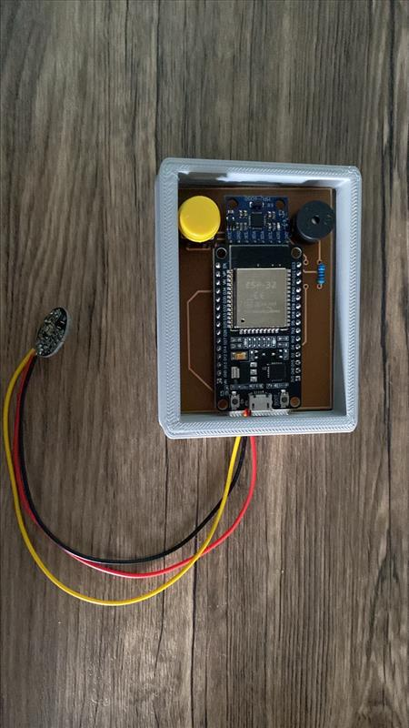

### Web Dashboard
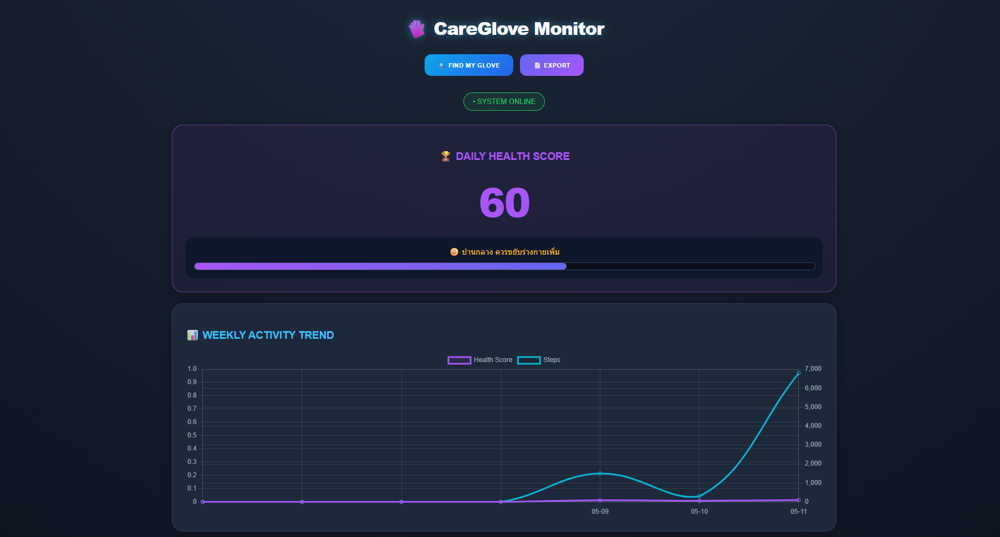
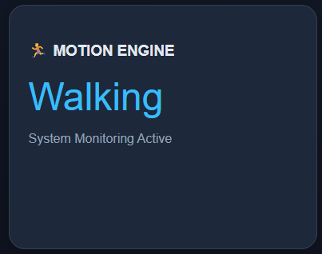
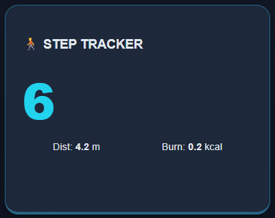
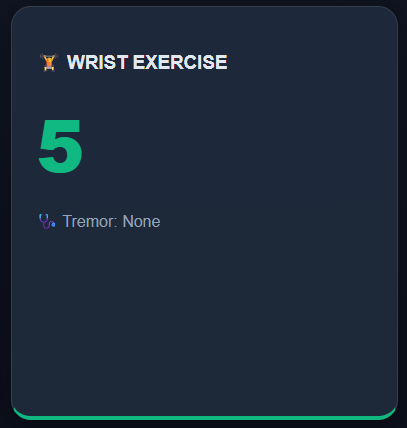
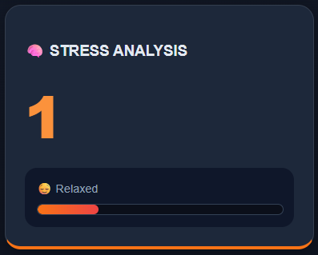
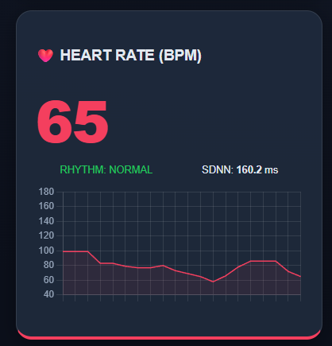
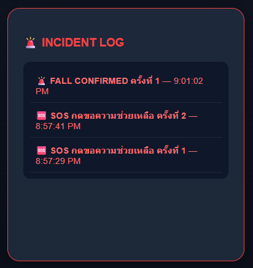
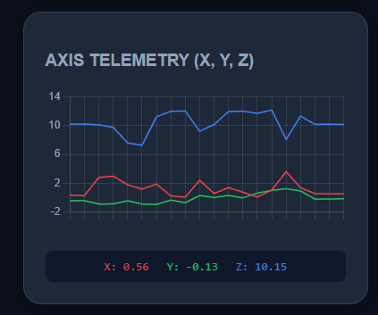
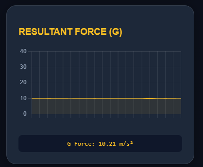

### Firebase Realtime Database
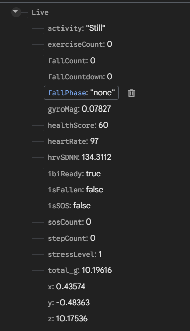

### System Design
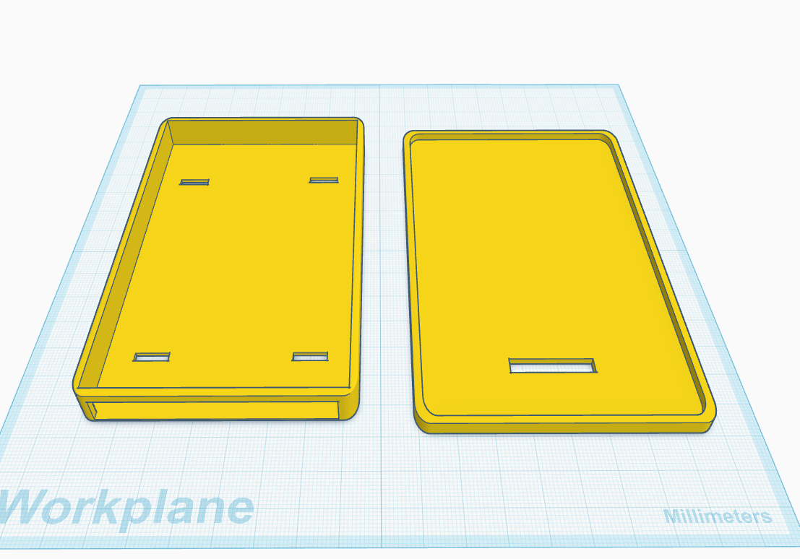
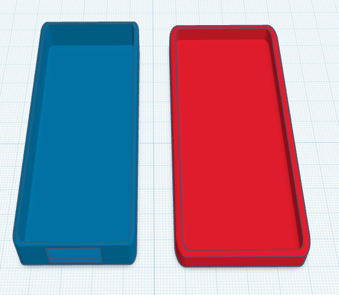
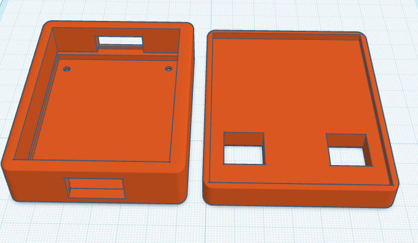
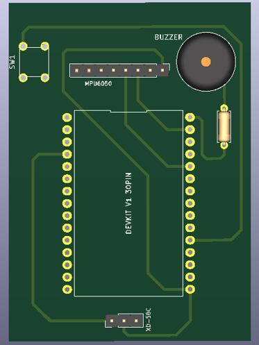

### Telegram Notification
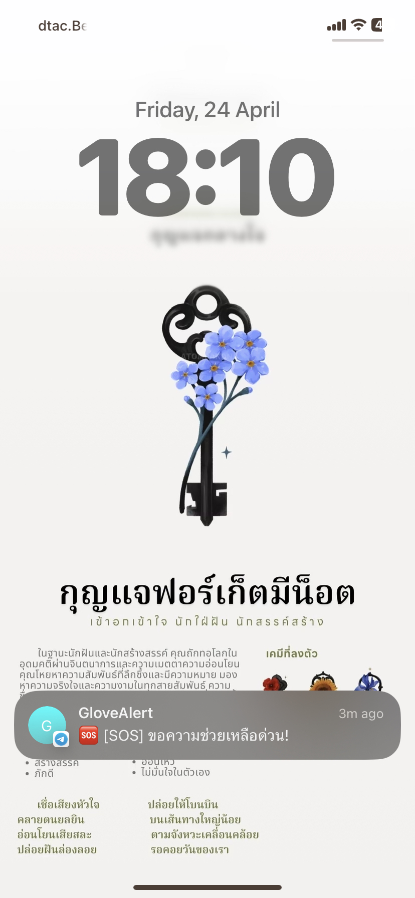
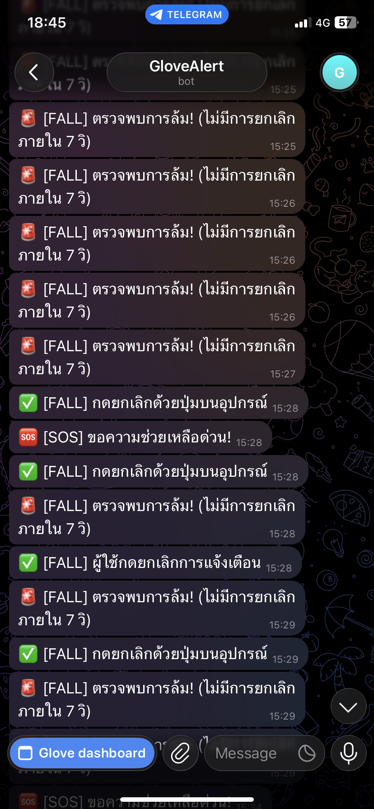
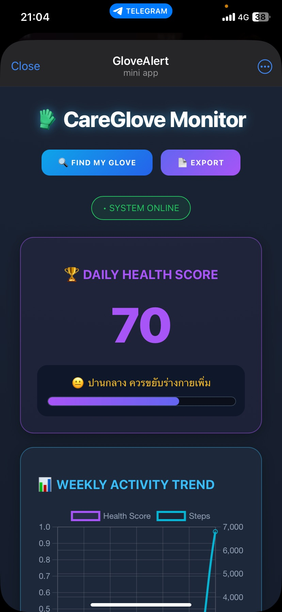
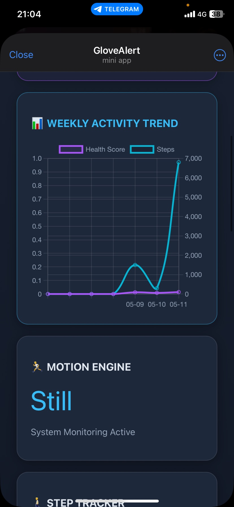
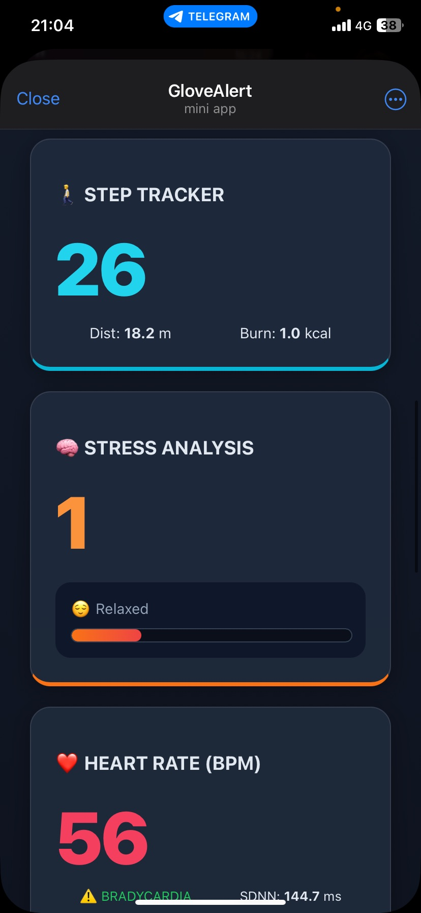
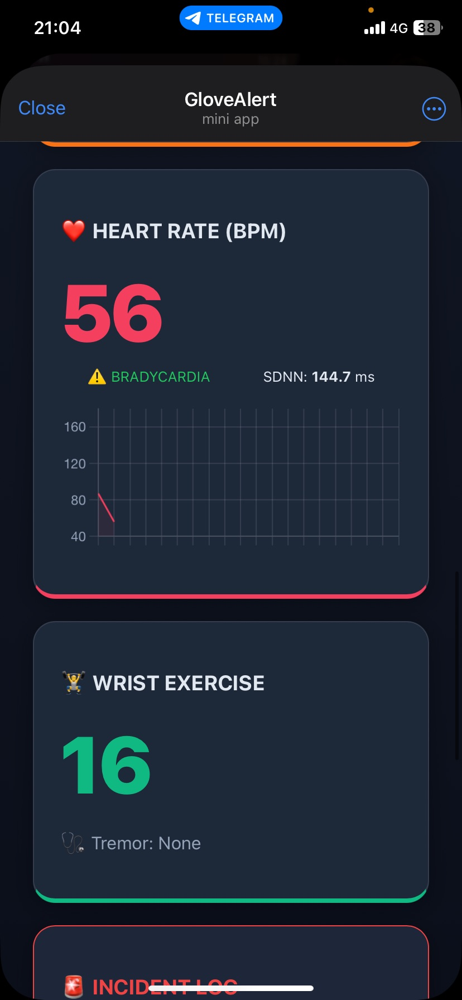
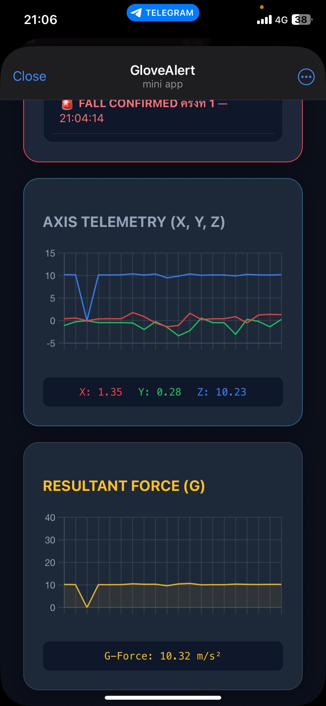

## Project Structure

```text
Smart-Wearable-Fall-Detection/
├── images/          # Project images
├── src/
│   ├── main.cpp
│   └── Dashboard.html
├── .gitignore
├── platformio.ini 
└── README.md
```
